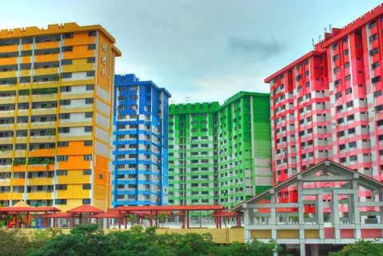

# HDB Resale Prices Predictive Modeling

## Project Overview

The HDB resale market in Singapore has become highly competitive, characterized by increasing demand and fluctuating pricing trends. WOW!, a top-tier real estate agency in Singapore, aims to equip its agents with a powerful, data-driven tool to:

- Provide clients with expert pricing advice for buying or selling HDB resale flats in a dynamic market.
- Precisely estimate the value of HDB resale flats across various flat types and locations.

In response to this, the CEO has tasked the Head of the Data Analytics Team with analyzing the HDB resale market and developing an advanced predictive model to deliver accurate insights in a short turnaround time.

## Table of Contents
1. [Problem Definition](#problem-definition)
2. [Data Collection](#data-collection)
3. [Data Limitations](#data-limitations)
4. [Data Cleaning](#data-cleaning)
5. [Analysis](#analysis)
6. [Key Features](#key-features)
7. [Modeling](#modeling)
8. [Future Work](#future-work)

## Problem Definition
- Problem Statement
  - Develop a linear regression model to accurately predict the value of HDB resale flats, taking into account various flat types and locations. Additionally, create an interactive dashboard that allows users to easily access and visualize these property valuations.
    
- Audiences
  - CEO of WOW! 

## Data Collection
- **Dataset Overview**:
  - GA's ‘train_data.csv’, 78 columns x 150,634 rows, January 2012 to April 2021
  - GA's ‘test_data.csv’, 78 columns x 16,737 rows, March 2012 to April 2021

- **Data Description**: Floor Level, Unit Type, HDB Age, Location, Approximate distance to Public Transport/Hawker Center/etc.

## Data Limitations
- **Limited HDB townships data**: Only ⅛ of the historical data have been used for training and data analysis, on basis of total number of actual historical sold resale flats in Singapore from 2012 to 2021
- **Historical biases**: As resale prices trends overtime due to several external factors (such as: changes in employment rate, foreign investment or even inflation) and government policies to curb the rising prices of resale flats in Singapore

## Data Cleaning
- **Missing Values**: Replaced with '0' for mall within 500km, 1km and 2km and for hawker within 500m, 1km and 2km that have null values
- **Remove data**: Dropped 829 data  for 'mall nearest distance'
- **Duplicates**: No duplicate rows 
- **Data Transformation**: Converted data to the correct format
  
## Analysis
- **Feature Engineering**:
  -	Created ‘region’ which has 'north', 'east', 'west' and 'central' from ‘town’ 

 - **Overview of HDB Resales Prics from 2012 to 2021**
  
    

    - **2012 - 2013**: Peak due to high demand and economic growth
    - **2013 - 2014**: Cooling measures was introduced to stabilise the rising resale price
    - **2015 - 2019**: Stabilizing with steady market correction
    - **2020**: Covid-19 caused uncertainty in market and shift in housing preference
    - **2021**: Demand peaks after lockdown ended

- **Exploratory Data Analysis (EDA)**: 

    Distribution of HDB resale prices: <ins>$400k - $500k is the most frequently transacted value<ins>

    

    Average HDB resale prices by region: <ins>HDB resale price is the most expensive in central<ins>
  
    

    Average HDB resale prices by storey level: <ins>HDB units with higher floor commands higher prices<ins>
    
    

    Average HDB resale prices by floor area (sqm): <ins>Bigger HDB flats are transacted to have higher resale values<ins>
    
    

    Average HDB resale prices across different flat types: <ins>The bigger the HDB unit the more expensive it is<ins>
    
    

    

## Key Features
- Town
- Floor Area (sqm) 
- Lease Commence Year 
- Transaction Year 
- Transaction Month 
- Distance to Mall, Hawker & MRT
- Storey Range

## Modeling
- Predictive modeling is built using linear regression, with correlation between key features < ±0.9
- Linear relationship between resale price and different factors .
- For example: 
  - Every km further from MRT would decrease the unit value by $25,000
  - Every sqm increase will have an positive impact of $ 104,000

- Results:

  

  - RMSE: 55,000 (Based on our model, the predicted price can vary from the actual price by $55,000 on average)

  - R2 Score : 0.85 (85% of the changes / variation in the resale prices of HDB houses can be explained by our model)

## Future Work

Future enhancements for this linear regression model include:
- Experimenting with more complex models like Random Forests, Gradient Boosting Machines (GBM), or XGBoost can improve predictive accuracy.
- Incorporating a new feature, 'supermall proximity,' to better capture the influence of nearby shopping malls on HDB resale values.
- Enhancing the Tableau dashboard to improve interactivity, user experience, and data visualization.
- Implementing Auto ARIMA for time-series forecasting to further refine predictions based on market trends and seasonal fluctuations.
